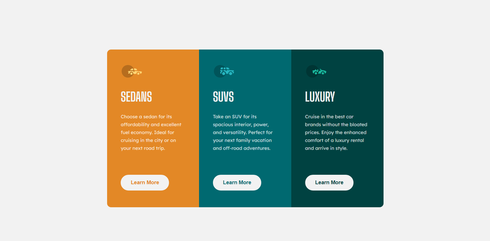

# Frontend Mentor - 3-column preview card component solution

This is a solution to the [3-column preview card component challenge on Frontend Mentor](https://www.frontendmentor.io/challenges/3column-preview-card-component-pH92eAR2-). Frontend Mentor challenges help you improve your coding skills by building realistic projects. 

## Table of contents

- [Overview](#overview)
- [Screenshot](#screenshot)
- [Links](#links)
- [Built with](#built-with)
- [What I learned](#what-i-learned)
- [Author](#author)

## Overview

For my third independent html/css project, I decided to try to recreate this design for a product preview card Component. I used CSS Flexbox to center the entire card in the screen, and I used CSS grid to make the card more responsive.

## Screenshot

## Links
- Live Site URL: [Add live site URL here](fg-jax.github.io/3-column-preview-card-component/)

## Built with
- CSS Flex
- CSS Grid

## What I learned
I can feel a bit more confident in recreating designs using flex and grid. I also learned to properly import fonts. In this project, I've also made use of position related css commands because I noticed that the provided designs weren't vertically centered.

## Author
- Frontend Mentor - [@ANGlenn](https://www.frontendmentor.io/profile/FG-Jax)

